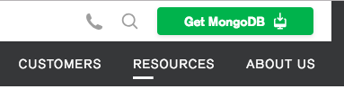
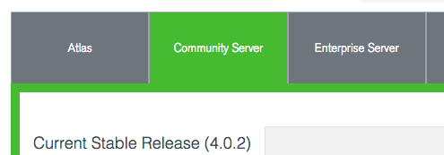

# Express Todo (MIT License)

Express Todo is a simple todo list web application in ExpressJS with MongoDB storage.

# Installation

Clone this repo into a local directory. For example:

    cd ~
    git clone https://github.com/tmillican/express-todo.git

The remaining instructions will assume you cloned this repo into `~/express-todo/`.

## Local Deployment

Mac users installing components via homebrew should run `brew update` once
before continuing.

### Install Node

Go to http://nodejs.org and install NodeJS.

Mac users may wish to install via homebrew:

   `brew install node npm`

### Install and Start MongoDB

Go to https://www.mongodb.com and click "Get MonogoDB" in the upper right:

Select the "Community Server" tab, then download and install MonogDB.

See https://docs.mongodb.com/manual/administration/install-community for
detailed installation instructions.

Or, if using homebrew on Mac:

    brew install mongodb

Create a data directory for MongoDB. For example:

    mkdir -p ~/mongo/db

Start the MongoDB server:

    mongod --dbpath <path to data directory>

If you omit the `--dbpath` option, the default path is `/data/db`.

### Install NodeJS Dependencies

Change into the Express Todo directory:

    cd ~/express-todo

Install all the NodeJS dependencies:

    npm install

### Run NodeJS

Run the app with:

    node start.js

Then navigate to `http://localhost:3000`
